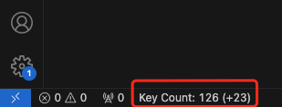

# key-press-counter

This is a keyboard press counter.

Do you sometimes want to know how many times of keys you pressed in VSCode or your project? This extension helps you count them. Also, you can even costomize some settings in it.

## Features

### Key Press Monitor
There are 2 counters in this extension.
- The left one is **total key press counter**. It will record all your key presses in vscode.
- The right one (eg.`+16`) is **current session key press counter**. It just record your key presses in current session.

### Notification

## Setting

| command | default | description |
|---|---|---|
| KeyPressCounter: Active/Inactive | Active | Decide the counter to monitor key presses or not. |
| KeyPressCounter: Set message push count | 500 | Set the number of times you press the keyboard every time to receive a message. |
| KeyPressCounter: Reset current session counter | | Set the current session counter number to 0. |

## Release Notes

### 0.0.1

1. Initial release of key-press-counter!

### 0.1.0

1. A new persistent counter which can record all your key presses even you restart vscode.

2. Original counter be the Current Session Counter, which helps record the key presses in current session.

3. Reset Counter command helps reset the Current Session Counter.

### 0.1.1

1. Fixed multi-windows counter problems.
